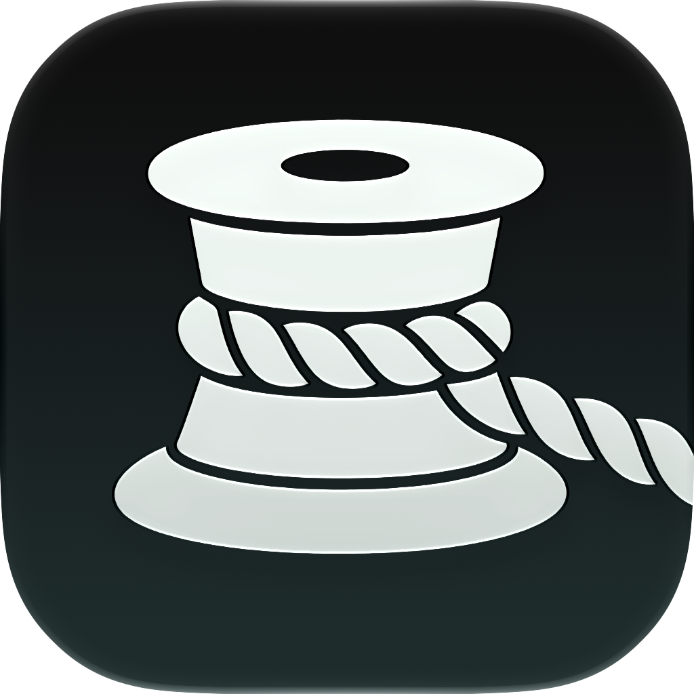
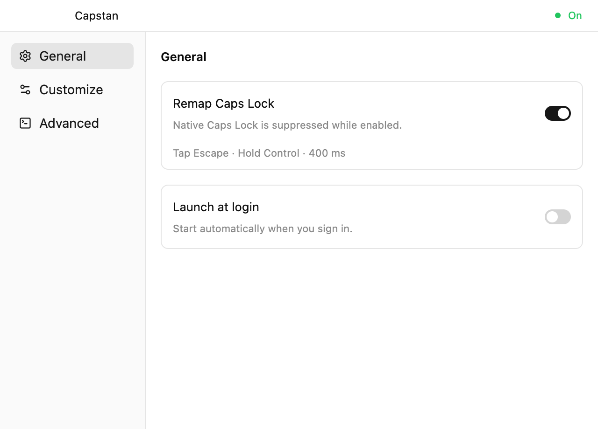
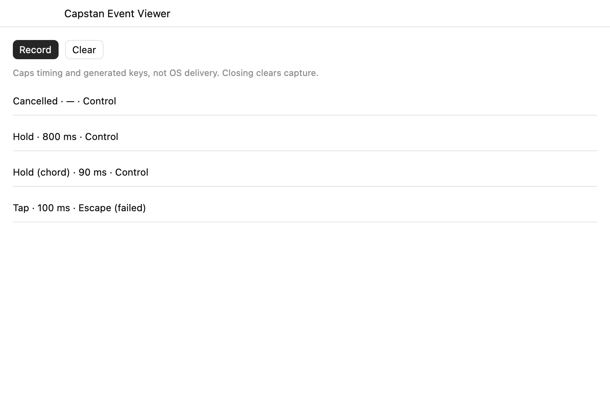

# Capstan

A small macOS app that gives Caps Lock two jobs:

- **Tap:** Escape.
- **Hold:** Control, immediately.

## A quick look





_UI previews rendered from the real components with test data._

## Try it

The current build is for **Apple Silicon Macs running macOS 14 or newer**.

1. Move `Capstan.app` to **Applications**.
2. Quit Karabiner-Elements or other keyboard remappers.
3. Open Capstan, grant **Input Monitoring** and **Accessibility**, then quit and reopen it.

- **General** controls remapping and Launch at login.
- **Customize** changes the tap key, held modifier and timeout. -
- **Advanced** contains menu-bar visibility, Event Viewer and Reload Settings.

Closing settings keeps remapping running. Open Capstan again to return, even if its menu icon is hidden.

### Event Viewer

Press **Record**, then try Caps Lock. Each row shows the action, duration and mapped key. **Stop** ends capture; **Clear** removes it. Closing the viewer stops and clears capture.

Only Caps-related events are retained, in memory, up to 200 events. The viewer reports generated translations, not proof that another app received them.

## Build locally

The built app targets Apple Silicon Macs running macOS 14 or newer. Your build Mac must also meet the system requirements of the Xcode version you install.

### 1. Install Xcode and its Metal Toolchain

Install a recent **full Xcode** with Icon Composer support, then open it once and finish setup. Command Line Tools alone are not enough: GPUI compiles Metal shaders, and the app icon needs Xcode's asset compiler.

If Xcode is installed in the usual location:

```sh
sudo xcode-select --switch /Applications/Xcode.app/Contents/Developer
sudo xcodebuild -runFirstLaunch
xcodebuild -downloadComponent MetalToolchain
```

Check that the required tools are available:

```sh
xcrun --find metal
xcrun --find metallib
xcrun --find actool
```

### 2. Install Rust

Install the current stable toolchain through [rustup](https://rustup.rs), then reopen Terminal or load its environment:

```sh
source "$HOME/.cargo/env"
rustup update stable
```

### 3. Create a local signing certificate

In **Keychain Access → Certificate Assistant → Create a Certificate**:

- Name: `Caps Tap Local`
- Identity Type: **Self Signed Root**
- Certificate Type: **Code Signing**

Create it in your login keychain. Open the certificate's **Trust** settings and set **Code Signing** to **Always Trust**. Confirm that macOS recognizes it:

```sh
security find-identity -v -p codesigning
```

The output must include a valid `Caps Tap Local` identity. This certificate is for your own builds, not Apple-verified distribution. Do not share its private key.

### 4. Clone and build

```sh
git clone https://github.com/andreasdelu/capstan.git
cd caps-tap
scripts/build-app
```

The signed app is written to `dist/Capstan.app`. Set `CAPS_TAP_SIGNING_IDENTITY` to use a different valid signing certificate.

Optional checks:

```sh
cargo test --locked
codesign --verify --deep --strict dist/Capstan.app
```

### 5. Run it

Move `dist/Capstan.app` to **Applications**, quit other keyboard remappers, and open it. Grant **Input Monitoring** and **Accessibility**, then quit and reopen Capstan. Use a stable app location before enabling Launch at login.

Managed Macs may block local builds or permission grants; ask IT rather than disabling security controls.

## Settings and development

Settings live in `~/Library/Application Support/Capstan/settings.json`. UI changes save automatically; external edits need **Advanced → Reload Settings**.

See [development notes](docs/development.md) for the JSON format, tests and packaging details.

Capstan is experimental!!!
